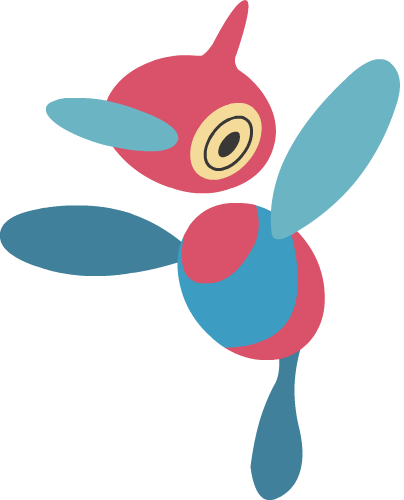

# Zbot

Pokémon Go Discord bot with the ability to read raid screenshots and more

Named after Porygon-Z, Zbot is a Python 3.5+ code for a Discord bot to help
organise small Pokémon Go communities. Keep track of:
* Raids
  * Via gym screenshot
  * Via text command
* Raid attendance
  * Express interest in a raid via Discord reactions
  * Suggest a meet time via text command
* Research rewards

Small details:
* Raid cool-down timers for each gym
* "Say what you mean" text command system
* Typo/spelling tolerance on Pokéstop/Gym locations

__Requrements__

Minimum Python version 3.5 (for `asyncio`)

Modules 
* `discord.py` Rewrite branch https://github.com/Rapptz/discord.py/tree/rewrite
* `numpy`
* `pyxDamerauLevenshtein`

Optional modules (for image recognition)
* `pytesseract` (requires tesseract installation)
* `opencv-python-headless`

Tested on x86_64 Linux/MacOS. ARM64 (Aarch64) Linux.

__Installation__

Tesseract-OCR should be centrally installed either through your package manager
of choice or from https://github.com/tesseract-ocr/tesseract. Zbot has been most
extensively tested with version 3.05.01 and 3.05.02. The latter version is
recommended. Tesseract 4.x support is planned but untested.

`git clone https://github.com/PoGoZbot/Zbot`

`pip install -U --user -r requirements.txt`

__Configuration__

Copy `config.py.example` to `config.py`.

The absolute minimum Zbot needs to work is:
* Discord bot token
* A decoded (.json) copy of the "game master" file
  Ready-made versions available:
  * https://github.com/pokemongo-dev-contrib/pokemongo-game-master
  * https://github.com/ZeChrales/PogoAssets
In this minimal form, you can send a direct message to Zbot with a raid screenshot
and it will reply with its best guess.

To be fully functional it also needs:
* Gyms and Pokéstop names (optionally locations, images and EX eligibility)
* IDs for the Discord channels for it to use

__Run__

`python3 zbot.py`

__Community Support__

The code for Zbot is provided "as is". Please join the "Zbot for Pokémon Go" Discord
server for community discussion. https://discord.gg/xmJMANX

__Patreon__

Zbot is open source and free-of-charge. If you wish, you can support the project
through Patreon at https://patreon.com/Zbot

__Code Contribution__

Pull requests are welcome. Approval subject to code review and testing.
Full guidelines to be found in `CONTRIBUTING.md`.

__Acknowledgements__

The wonderful guinea pigs from my local Pokémon Go Discord server for fearlessly
using Zbot during development!

Art for vector Zbot icon from https://www.deviantart.com/taerkex

__License__

LGPL v3.0 - https://github.com/PoGoZbot/Zbot/blob/master/LICENSE

__Disclaimer__

The author is in no way affiliated with Niantic Inc., The Pokémon Company or any
related organisations.
